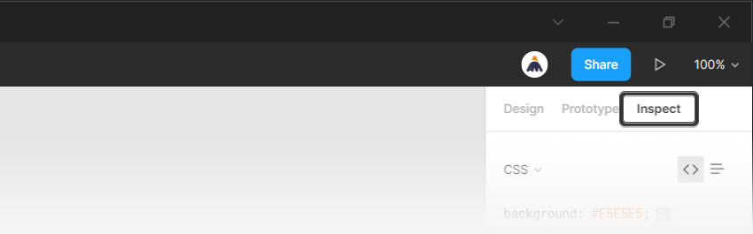
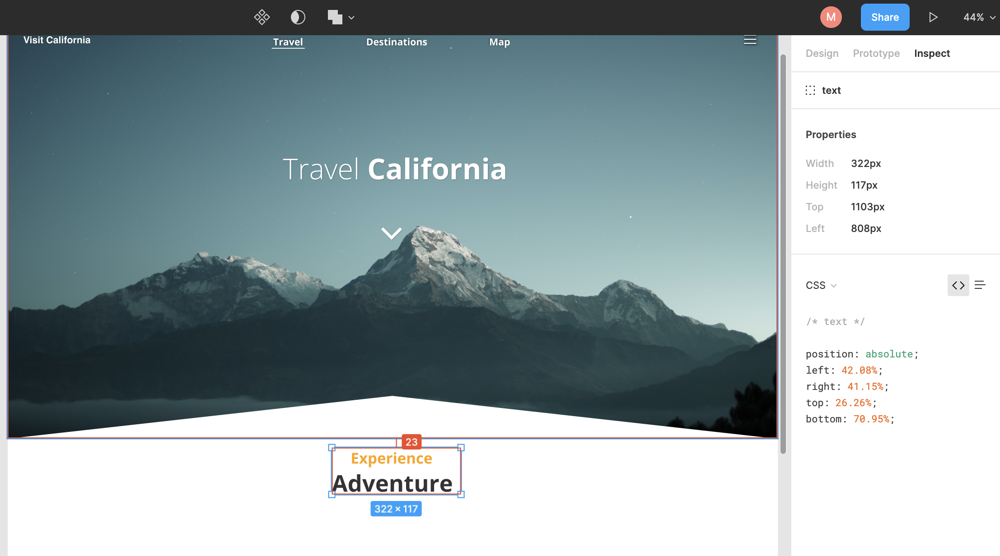

# Code Travel California Website

In this activity, you’ll review a creative brief, and you will code a webpage for Travel Calfiornia using Boostrap 4, HTML, and CSS.

- A creative brief’s purpose is to help guide your design decisions when you receive a design from a product manager or client. A creative brief communicates how a design should look, feel, and emulate the style of the design they’re looking for. 

- As a developer, we use redlined wireframes to better understand the layout handed off to us, so we have a visual idea of how we want to go about coding up the page. When we see a design as a series of boxes, it helps us digest a task that can sometimes feel overwhelming at first glance.

## Review the Brief

TRAVEL CALIFORNIA

Hello, we are Travel California and we need a website developer to bring our vision of our new webpage to life. Our in-house designer did a pretty good job, but feel free to tweak our design if you feel like you have ideas that can make us better. 

We like:
- Strong, legible fonts.
- Clear, well-defined sections.
- Lifestyle imagery that shows off the sights and scenery of California. The imagery must be crisp and make our viewers want to explore California.

Ways you can contribute:
- Many of our sections could use extra UI elements or features. Everything looks nice, but we wouldn’t mind more ways to interact with the webpage.
- Color scheme: If you want to explore another color palette, feel free! But try to stick to the style we have laid out in the design.
- Our typography looks nice, but we are always open to other suggestions. Maybe you can add a font that feels more... adventurous? 

Your final solution should look similar to this:

## Wireframes

Your assets and wireframes have already been finished for you. Normally you would need to do this yourself. You can see the images and wireframes in the appropriate folders.

## Instructions

### Part 1: Build the HTML 

It’s time to build the structure of your webpage. 

**Notes**

- Use custom HTML and Bootstrap to start the build process.

- While you do have creative control over the end product, keep in mind that the client is looking for specific things that are detailed in the creative brief.

- Most web developers build the containers and structure of their design before they style the webpage aesthetics. Building the site structure is the hardest part of being a front-end web developer, so don’t be surprised if you struggle a bit with this step! It’s normal. Redline the designs that you are handed!

- Below, you will find some tips on how you could build this layout. These rules, however, are not set in stone, and there are multiple ways to build the website.

1.  Start with a jumbotron that contains the following HTML tags: https://getbootstrap.com/docs/4.3/components/jumbotron/.
- A `header` component that you will customize later.
- Add a `nav` tag with the id `mainNav`.
  - Add a `div` tag with the class `container`.
    - Add a `link` tag with the text: travel california. 
  - Add a `div` tag.
    - Inside the `div` create an `unordered list` tag.
    - Add three `list items` for each link.
- Add a `header` tag with the class `masthead`.
  - Add a `div` tag with the class `container`.
    - Add a `div` tag with the class `row`.
      - Add a `div` tag with class `col-lg-7`.
        - An `h1` tag to hold “Download the Travel California app and explore California today!”
      - Add a `div` tag with class `col-lg-5`.
        - Add a `div` tag with the class `device-container`.
          - Add a `div` tag with the class `device`.
          - Add a `div` tag with the class `screen`.
          - Inside the div, add an `image` tag.
          - Give your image the path `src="img/demo-screen-1.png"`.

2. A `section` tag with the class `download` and id of `download` that contains the following HTML tags:

- Add a `div` tag with the class `container`.
  - Add a `div` tag with the class `row`.
    - Add a `div` tag with the class `col-md-8`.
      - An `h2` with the class `section-heading` to contain our text “Discover what all the buzz is about!”
      - A `p` to containt our text "Our app is available on any mobile device! Download now to get started!"
    - Add a `div` tag with the class `badges`.
      - Add a `link` tag with the class `badges-link`.
        - Add an `image` tag with the `src="img/google-play-badge.svg"`.
        - Add an `image` tag with the `src="img/app-store-badge.svg"`.

3. A `section` tag with the class `testimonials` that contains the following tags:

- Add a `div` tag with the class `container`.
  - An `h2` to contain our text “What people are saying...”
  - Add a `div` tag with the class `row`.
    - Create cards for each testimonial.
    - Add a `div` tag with the class `col-lg-4`.
      - Add a `div` tag with the class `testimonial-item`.
        - Add an `image` tag.
        - Add an `h5` with the name of the testimonal user.
        - Add a `p` tag with text.
    - Repeat this process for the next two cards.

4. A `section` tag with the class `signup-section` and id `signup` that contains the following tags:

- Add a `div` tag with the class `container`.
  - Add a `div` tag with the class `row`.
    - Add a `div` tag with the class `col-lg-8`.
      - Add an `i` tag; you can use this to add an icon from the font-awesome library.
      - Add an `h2` tag with the copy "Subscribe to receive updates!"
      - Add a `form` tag.
        - Add an `input` tag inside the form tag.
        - Add a `button` tag with the text "Subscribe."

5. A `section` tag with the class `contact-section` and `bg-black` that contains the following tags:

- Add a `div` tag with the class `container`.
  - Create a row to house the three cards in the design.
  - Add a `div` tag with the class `row`.
    - Add a `div` tag with the class `col-md-4`.
      - Add a `div` tag with the class `card`.
        - Add a `div` tag with the class `card-body`.
          - Add an `i` tag and use the font-awesome library to add an icon.
          - Add an `h4` tag with the class `text-uppercase` and fill in the copy.
          - Add a `div` tag and inset the copy from the design.
  - Repeat this process for the next two cards in the design.
  - Add a `div` tag with the class `social`.
    - Add three `link` tags.
    - Add an `i` tag inside each link and add a font-awesome class to add an icon.

6. A `div` with the class of `footer` that contains another div holding a `p` tag that says "Copyright" [Insert Your Name 2021].

### Part 2: Build the CSS (Style the Webpage)

For this section you will need to sign up for the software **[Figma](https://www.figma.com)**. Figma is a powerful design software that UX designers will use to create webpages before they are coded.

Once you have signed up, follow the instructions below to access the Travel California Figma File:

1. Open the [figma file](https://www.figma.com/file/xRhD5mUQHtdAImH8DUZQz8/Redline-Zeplin-Wireframe-Template?node-id=102%3A330) for Travel California.
2. Click the menu button in the top left. Select FILE > SAVE LOCAL COPY.
3. Import the file into your Figma Dashboard
4. Open the file.

The Inspect tab in Figma lets you view and copy the existing code and values for your designs. Copy single line items or entire sets of values to make the development process easier.

5. The Inspect panel can be opened from the right sidebar with a simple click on the "Inspect" tab at the top.

- Using this panel, you can easily inspect the properties of any element from your design.

6. Use Figma's Inspect panel to view and copy values for your selection.

  - Properties include values for an object's dimensions and constraints.
  - View the Content in a text layer.
  - View the Typography values for a text layer, including font, weight, line height, and more.
  - Use the Color section to view values in Hex, RGB, CSS, HSL, and HSB color models.
  - Copy values for an object's Shadows (inner and drop shadow) and Borders (stroke).
  - View the details of any prototyping Animation, including the trigger, action, and destination. You can also see the animation, the easing curve, and duration of the transition.
  - View CSS for your selection.
    - Be careful with these properties. You will be using CSS to do much of the positioning for you.

7. Add imagery and fonts to your website.

- The images you will need can be found in the `images` folder.
- To find custom fonts, check the Travel California Adobe Figma Inspect or visit https://fonts.google.com to select your own. 

8. Review the resources for extra help and good luck!

### Resources

- [How to use font-awesome](https://www.w3schools.com/icons/fontawesome_icons_intro.asp)

- [Figma tutorial: Handoff seamlessly to developers](https://www.youtube.com/watch?v=B242nuM3y2s)

- [How to use Figma’s Inspect panel](https://webdesign.tutsplus.com/tutorials/how-to-use-figmas-inspect-panel--cms-36323)

- **Tip:** If you get stuck, use your Google-fu to find answers about how to style specific elements (e.g., Google phrases like, “How to make a container span the full width of its parent” or “How to underline an h1 tag”).

---

© 2022 edX Boot Camps LLC. Confidential and Proprietary. All Rights Reserved.
